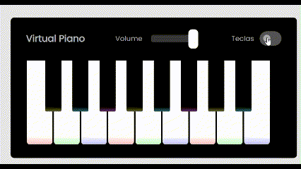

# Construindo um Simulador de Piano com JavaScript e CSS

Projeto de um **Piano Virtual** utilizando JavaScript, HTML, e CSS.

## Funcionamento ⚙️

O usuário pode tocar as notas do piano clicando nas teclas virtuais ou pressionando as teclas correspondentes no teclado. Recursos adicionais incluem controle de volume e um efeito visual de nota musical flutuante.

- As notas podem ser tocadas clicando nas teclas do piano ou pressionando as teclas do teclado;
- Um controle de volume permite ajustar o som das notas;
- Um efeito visual de uma nota musical flutuante aparece ao tocar qualquer tecla;
- O mapeamento das teclas do teclado pode ser exibido ou ocultado com um botão de alternância.

## Tecnologias Utilizadas 💻

- **HTML**: Estrutura do piano virtual e controles de volume.
- **CSS**: Estilos do piano, teclas, controle de volume, e animação das notas flutuantes.
- **JavaScript**: Lógica de reprodução de áudio, controle de volume, animação e interação com o teclado.

## Como Rodar 🕹️

1. Clonar ou Baixar o repositório.
2. Garantir que o diretório `src/tunes/` contenha os arquivos `.wav` correspondentes para as teclas do piano.
3. Executar o arquivo `index.html` no navegador para começar a tocar.
